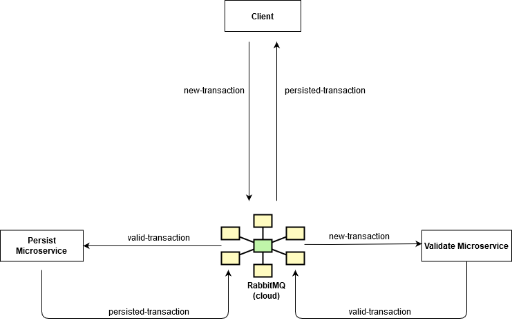

### The solution I provided is basesd on async communication based on messaging through RabbitMQ



#### Run as each application as
``` 
./mvnw spring-boot:run
```
#### Client application has a REST endpoint where you can POST transactions.
```
POST: http://localhost:8080/transaction
```

##### Example transaction json:
``` 
{
	"payer" : {
		"name" : "Tiberiu Marinica",
		"CNP" : "5000326135291",
		"IBAN" : "RO66PORL7242895992327856"
	},
	
	"payee" : {
		"name" : "Ion Ionescu",
		"CNP" : "2940825147591",
		"IBAN" : "RO21RZBR9234222628351991"
	},
	
	"type" : "WALLET_TO_IBAN",
	"sum" : 996.83,
	"description" : "descriere"
}
```

#### To get transactions report, call client application report endpoint, and see output in console:
```
http://localhost:8080/reportRequest/allTransactions
```
